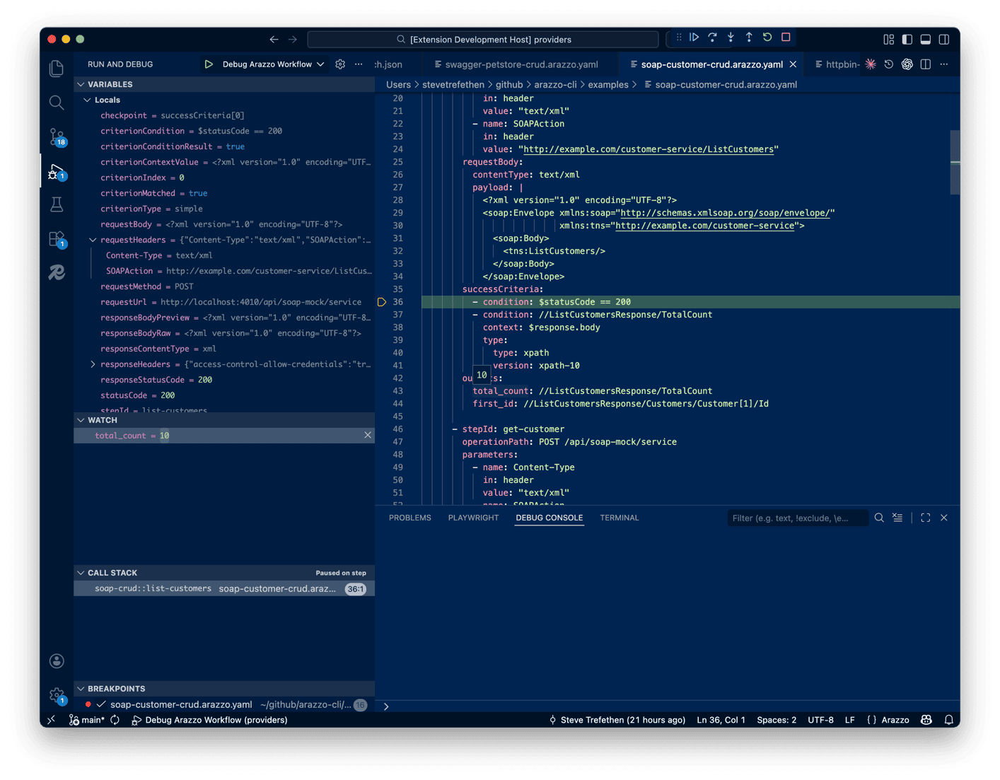

# arazzo-cli

[](https://github.com/strefethen/arazzo-cli/actions/workflows/ci.yml)
[](https://www.rust-lang.org/)
[](https://opensource.org/licenses/MIT)

**Execute multi-step API workflows from a YAML spec — no code generation, no glue scripts.**

arazzo-cli is a standalone executor for [Arazzo](https://spec.openapis.org/arazzo/latest.html), the OpenAPI Initiative's spec for describing sequences of API calls as declarative workflows. Define your steps, parameters, success criteria, and control flow in YAML, then run them directly from the command line or step through them in VS Code.

## Why?

Testing a sequence of API calls today means writing imperative scripts, maintaining Postman collections, or building custom test harnesses. The Arazzo spec (part of the OpenAPI ecosystem) lets you describe these sequences declaratively — but without a runtime, the spec is just documentation.

arazzo-cli makes Arazzo specs executable: validate them, run them, trace them, and debug them interactively.

## Quick Start

```bash
git clone https://github.com/strefethen/arazzo-cli.git
cd arazzo-cli
cargo run -p arazzo-cli -- validate examples/httpbin-get.arazzo.yaml
cargo run -p arazzo-cli -- run examples/httpbin-get.arazzo.yaml get-origin
```

Or install it:

```bash
cargo install --path ./crates/arazzo-cli --locked
arazzo validate examples/httpbin-get.arazzo.yaml
arazzo run examples/httpbin-get.arazzo.yaml get-origin
```

## Features

| Feature | What it does |
|---|---|
| **Run workflows** | Execute HTTP steps, resolve expressions, evaluate success criteria, route control flow |
| **Run single steps** | Execute one step with automatic dependency resolution (`--step`) |
| **Generate workflows** | Scaffold CRUD workflows from OpenAPI 3.x specs (`generate`) |
| **Validate specs** | Parse and structurally validate Arazzo YAML before running |
| **Parallel execution** | Run independent steps concurrently with DAG-based scheduling (`--parallel`) |
| **Dry-run mode** | Resolve all requests without sending them (`--dry-run`) |
| **Input validation** | Type-check and require workflow inputs, with strict mode (`--strict-inputs`) |
| **Execution traces** | Write detailed `trace.v1` JSON artifacts with automatic sensitive value redaction |
| **Deterministic replay** | Re-execute trace artifacts offline with response injection and drift checks (`replay`) |
| **Sub-workflows** | Call workflows from workflows with input/output passing (up to 10 levels deep) |
| **VS Code debugger** | Set breakpoints, step through workflows, inspect variables, evaluate expressions |
| **JSON output** | `--json` on every command for scripting and CI integration |
| **Expression language** | `$inputs`, `$steps`, `$response`, `$env`, XPath, JSON Pointer, interpolation |
| **Success criteria** | Simple expressions, regex, XPath, and JSONPath criterion types |
| **Control flow** | `onSuccess`/`onFailure` actions with goto, retry (with backoff), and end |
| **Multiple API sources** | Route steps to different APIs via `sourceDescriptions` |
| **SOAP support** | Execute SOAP workflows with XPath-based success criteria |
| **Rate limiting** | Built-in token-bucket rate limiter (10 req/sec default, configurable burst) |
| **`.env` loading** | Automatic `.env` file loading — reference secrets as `$env.VAR_NAME` |
| **Reusable components** | `$ref` to shared parameters, inputs, and action handlers via `components` |

## Contents

- [CLI Commands](#cli-commands)
- [Examples](#examples)
- [Execution Traces](#execution-traces)
- [VS Code Debugger](#vs-code-debugger)
- [Expression Language](#expression-language)
- [How It Works](#how-it-works)
- [Parallel Execution](#parallel-execution)
- [Success Criteria](#success-criteria)
- [Control Flow](#control-flow)
- [Input Validation](#input-validation)
- [Sub-Workflows](#sub-workflows)
- [Generating Workflows](#generating-workflows)
- [Safety and Correctness](#safety-and-correctness)
- [Programmatic API](#programmatic-api)
- [Repository Layout](#repository-layout)
- [Building from Source](#building-from-source)
- [Contributing](#contributing)

## CLI Commands

```
arazzo run <spec> <workflow-id>        Execute a workflow
arazzo replay <trace.json>             Replay a trace.v1 artifact with injected responses
arazzo validate <spec>                 Parse and validate a spec
arazzo list <spec>                     List workflows in a spec
arazzo steps <spec> <workflow-id>      List steps within a workflow
arazzo catalog <dir>                   Discover specs across a directory tree
arazzo show <workflow-id> --dir <dir>  Display workflow details (inputs, outputs, steps)
arazzo generate --spec <openapi>       Generate Arazzo workflows from an OpenAPI spec
arazzo schema [command]                Print JSON Schema for a command's --json output
```

Global flags:

- `--json` — structured JSON output (all commands)
- `--verbose` — step-by-step execution details

`run` flags:

- `--input key=value` — workflow input (repeatable)
- `--input-json key=<json>` — JSON-typed input (repeatable)
- `--header Name=value` — HTTP header applied to all requests (repeatable)
- `--step <step-id>` — execute a single step (auto-resolves upstream dependencies)
- `--no-deps` — skip dependency resolution when using `--step` (isolated execution)
- `--strict-inputs` — make input validation errors fatal (missing required fields, type mismatches)
- `--http-timeout <duration>` — per-request timeout (default `30s`)
- `--execution-timeout <duration>` — overall workflow deadline (default `5m`)
- `--max-response-size <bytes>` — response body size limit (default `10485760` = 10 MiB)
- `--parallel` — execute independent steps concurrently
- `--dry-run` — resolve requests without sending
- `--openapi <path>` — operationId source spec (repeatable)
- `--expr-diagnostics <off|warn|error>` — expression warning level (default `off`)
- `--trace <path>` — write a trace.v1 execution artifact
- `--trace-max-body-bytes <n>` — max body size in trace (default `2048`)

`replay` flags:

- `<trace.json>` — trace.v1 file to replay
- `--spec <path>` — override `run.specPath` recorded in the trace
- `--workflow-id <id>` — override `run.workflowId` recorded in the trace
- `--execution-timeout <duration>` — replay timeout (default `5m`)
- `--openapi <path>` — operationId source spec (repeatable)

`generate` flags:

- `--spec <path>` — path to an OpenAPI 3.x spec (YAML or JSON; required)
- `--scenario <name>` — generation scenario (default `crud`)
- `-o`/`--output <path>` — write generated YAML to file instead of stdout

## Examples

The `examples/` directory contains 17 runnable specs:

| Spec | Demonstrates |
|---|---|
| `httpbin-get.arazzo.yaml` | Basic GET, headers, status codes, inputs |
| `httpbin-methods.arazzo.yaml` | POST, PUT, PATCH, DELETE with JSON bodies |
| `httpbin-auth.arazzo.yaml` | Basic auth, bearer tokens, auth failure handling |
| `httpbin-conditions.arazzo.yaml` | Comparison operators, contains, compound conditions |
| `httpbin-data-flow.arazzo.yaml` | Output chaining, interpolation, cookies, sub-workflows |
| `httpbin-error-handling.arazzo.yaml` | Retry, criteria-based goto, workflow-level failure actions |
| `httpbin-parallel.arazzo.yaml` | Parallel execution, diamond dependencies |
| `httpbin-response-headers.arazzo.yaml` | Reading and forwarding response headers |
| `httpbin-components.arazzo.yaml` | Reusable parameters and actions via components |
| `httpbin-chained-posts.arazzo.yaml` | Multi-step POST body chaining, onSuccess goto |
| `httpbin-reusable-inputs.arazzo.yaml` | `$ref` in workflow inputs, component schema reuse |
| `multi-api-orchestration.arazzo.yaml` | Multiple source descriptions, cross-API routing |
| `error-handling-retry.arazzo.yaml` | Retry logic with configurable delay and limits |
| `sub-workflow.arazzo.yaml` | Parent/child workflow composition with input/output passing |
| `auth-flow.arazzo.yaml` | Authentication workflow patterns |
| `swagger-petstore-crud.arazzo.yaml` | Full CRUD lifecycle against the Swagger Petstore API |
| `soap-customer-crud.arazzo.yaml` | SOAP XML workflows with XPath success criteria |

Try them:

```bash
# Validate
arazzo validate examples/httpbin-auth.arazzo.yaml

# Run with inputs
arazzo run examples/httpbin-get.arazzo.yaml status-check --input code=200

# Dry-run (no network calls)
arazzo run examples/httpbin-get.arazzo.yaml status-check --dry-run --input code=429

# Verbose output with step details
arazzo run examples/httpbin-parallel.arazzo.yaml independent-steps --parallel --verbose

# Run a single step (auto-resolves its dependencies)
arazzo run examples/httpbin-data-flow.arazzo.yaml chain-outputs --step use-uuid

# Generate CRUD workflows from an OpenAPI spec
arazzo generate --spec petstore.yaml -o petstore-crud.arazzo.yaml

# Write a trace file
arazzo run examples/httpbin-get.arazzo.yaml status-check --input code=429 --trace ./trace.json

# Replay a trace offline
arazzo replay ./trace.json
```

## Execution Traces

`run --trace <path>` writes a `trace.v1` JSON artifact capturing every step's request, response, criteria evaluation, and routing decision.

Sensitive values are automatically redacted:
- Headers: `Authorization`, `Cookie`, `X-API-Key`
- URL query params: `token`, `password`, `session`
- JSON body fields with sensitive keys

```json
{
  "schemaVersion": "trace.v1",
  "tool": { "name": "arazzo", "version": "0.1.0" },
  "run": {
    "workflowId": "status-check",
    "status": "success",
    "durationMs": 12
  },
  "steps": [
    {
      "seq": 1,
      "workflowId": "status-check",
      "stepId": "check-status",
      "decision": { "path": "next" }
    }
  ]
}
```

Schema reference: `docs/trace-schema-v1.md` | `docs/schemas/trace-v1.schema.json`

## VS Code Debugger

The project includes a full Debug Adapter Protocol (DAP) implementation with a VS Code extension for interactive workflow debugging.



**Capabilities:** breakpoints on steps/criteria/actions, conditional breakpoints, Step Over / Step In / Step Out / Continue / Pause, variable inspection (Locals, Request, Response, Inputs, Steps scopes), watch expressions, call stack with sub-workflow depth tracking.

### Setup

1. Build the debug adapter and extension:
   ```bash
   cargo build --release -p arazzo-debug-adapter
   cd vscode-arazzo-debug && npm install && npm run build && node scripts/copy-binary.js
   ```
2. In VS Code, press **F5** to launch the Extension Development Host
3. Create `.vscode/launch.json` in the new window:

```json
{
  "version": "0.2.0",
  "configurations": [
    {
      "type": "arazzo",
      "request": "launch",
      "name": "Debug Workflow",
      "spec": "${workspaceFolder}/examples/httpbin-get.arazzo.yaml",
      "workflowId": "get-origin",
      "stopOnEntry": true
    }
  ]
}
```

4. Open the Arazzo YAML file, set breakpoints on step lines, and press **F5**

### Launch Configuration

| Property | Type | Required | Description |
|---|---|---|---|
| `spec` | string | yes | Path to the `.arazzo.yaml` workflow spec |
| `workflowId` | string | yes | Workflow to execute |
| `inputs` | object | no | Key-value map passed as workflow inputs |
| `stopOnEntry` | boolean | no | Pause before the first step (default: `false`) |
| `runtimeExecutable` | string | no | Command to launch the debug adapter (default: `cargo`) |
| `runtimeArgs` | string[] | no | Arguments for adapter launch |
| `runtimeCwd` | string | no | Working directory for adapter launch |

### Breakpoints

Set breakpoints on any meaningful line in a YAML spec. The debugger maps source lines to internal checkpoints:

- **Step lines** (`- stepId: fetch-data`) — pause before execution
- **Success criteria** (`- condition: $statusCode == 200`) — pause at evaluation
- **onSuccess / onFailure actions** — pause at dispatch
- **Output lines** (`title: //item[1]/title`) — pause at extraction

Conditional breakpoints are supported — right-click a breakpoint and add an expression:

```
$statusCode == 429
$steps.fetch-auth.outputs.token != null
```

### Stepping

| Control | Behavior |
|---|---|
| **Continue** (F5) | Run to next breakpoint or end |
| **Step Over** (F10) | Next checkpoint at current workflow depth |
| **Step In** (F11) | Descend into sub-workflow calls |
| **Step Out** (Shift+F11) | Run until returning to parent workflow |
| **Pause** (F6) | Pause at next checkpoint |

### Variable Inspection

When paused, the Variables panel shows:

- **Locals** — `workflowId`, `stepId`, `checkpoint`
- **Request** — `method`, `url`, `headers`, `body`
- **Response** — `statusCode`, `contentType`, `headers`, `bodyPreview`
- **Inputs** — workflow input parameters
- **Steps** — completed step outputs as a nested tree

### Watch Expressions

Add expressions to the Watch panel or hover in the editor:

- `$inputs.name` — workflow input
- `$steps.fetch-data.outputs.token` — step output
- `$statusCode` — HTTP status code
- `$response.header.Content-Type` — response header
- `$response.body.data.origin` — JSON body path
- `//item[1]/title` — XPath query

### Debugger Architecture

Three-thread coordinator design prevents deadlocks during slow HTTP requests:

```
stdin ──> [Reader Thread] ──cmd_tx──> [Coordinator] ──> stdout
                                           ^
          [Engine Monitor] ──event_tx──────┘
                |
          [Runtime Engine]
```

Neither channel blocks the other. A slow HTTP request does not prevent processing VS Code commands (pause, disconnect, etc.).

## Expression Language

| Expression | Resolves to |
|---|---|
| `$inputs.name` | Workflow input parameter |
| `$steps.<id>.outputs.<name>` | Previous step output |
| `$outputs.name` | Workflow outputs map (inside `workflow.outputs`) |
| `$env.VAR_NAME` | Environment variable (`.env` auto-loaded) |
| `$statusCode` | HTTP response status code |
| `$method` | HTTP method (GET, POST, etc.) |
| `$url` | Fully constructed request URL |
| `$response.header.Name` | Response header (case-insensitive) |
| `$response.body.path` | JSON dot-path body extraction |
| `$response.body#/pointer` | RFC 6901 JSON Pointer body access |
| `$request.header.Name` | Request header |
| `$request.query.Name` | Request query parameter |
| `$request.path.Name` | Request path parameter |
| `$request.body` | Request body (dot-path or JSON Pointer) |
| `$sourceDescriptions.<name>.url` | Source description URL |
| `//xpath/expression` | XML/HTML extraction |

**String interpolation:** `{$expr}` embeds any expression in a string value (e.g., `"Bearer {$steps.auth.outputs.token}"`)

**Multi-source routing:** `{sourceName}./path` selects a source description's base URL

**Condition operators:** `==`, `!=`, `>`, `<`, `>=`, `<=`, `&&`, `||`, `contains`, `matches`, `in`

## How It Works

arazzo-cli is a pure **interpreter** — it reads your Arazzo YAML spec, resolves every expression at runtime, executes real HTTP requests, and routes control flow based on the results. There is no code generation step and no intermediate representation.

### Execution Pipeline

```
YAML spec ──> Parse & Validate ──> Build Engine ──> Execute Steps ──> Collect Results
                                       │
                           ┌───────────┼───────────────┐
                           │           │               │
                      Resolve      Send HTTP      Evaluate
                    expressions    request(s)     criteria
                           │           │               │
                           └───────────┼───────────────┘
                                       │
                                 Route control flow
                              (next / goto / retry / end)
```

For each step, the engine:

1. **Resolves parameters and request body** — substitutes `$inputs`, `$steps`, `$env`, and interpolated `{$expr}` values into the URL, headers, query params, and body
2. **Sends the HTTP request** — through a rate-limited client with configurable timeout
3. **Evaluates success criteria** — checks conditions like `$statusCode == 200`, regex patterns, XPath queries, or JSONPath filters against the response
4. **Extracts outputs** — pulls values from the response (headers, body paths, JSON Pointers) into the step's output map for downstream steps to consume
5. **Routes control flow** — matches `onSuccess` or `onFailure` action criteria to decide: advance to the next step, jump to another step (`goto`), retry with a delay, or end the workflow

The engine streams events as it runs. CLI output, traces, verbose logging, and the VS Code debugger all consume the same event stream — there is no special path for any consumer.

### .env File Support

On startup, arazzo-cli automatically loads a `.env` file from the current directory (if one exists). Values become available as `$env.VAR_NAME` in expressions:

```bash
# .env
API_KEY=sk-test-12345
BASE_URL=https://api.example.com
```

```yaml
# In your Arazzo spec
parameters:
  - name: Authorization
    in: header
    value: "Bearer {$env.API_KEY}"
```

This keeps secrets out of your spec files and makes the same workflow portable across environments.

## Parallel Execution

When you pass `--parallel`, the engine analyzes step dependencies and executes independent steps concurrently.

### How the DAG Scheduler Works

The scheduler uses a variant of **Kahn's algorithm** for topological sorting:

1. **Scan expressions** — for each step, find all `$steps.<id>.outputs.*` references to identify upstream dependencies
2. **Build a directed acyclic graph (DAG)** — if step B references `$steps.A.outputs.token`, add an edge A → B
3. **Compute execution levels** — Level 0 contains all steps with no dependencies. Level N+1 contains steps whose dependencies are all satisfied by levels 0..N
4. **Execute level by level** — within each level, steps run concurrently via async tasks. The engine waits for all steps in a level to complete before starting the next level
5. **Detect cycles** — if any steps remain with unresolvable dependencies, the engine reports a `RUNTIME_DEPENDENCY_CYCLE` error

```
Level 0:  [fetch-token]  [fetch-config]     ← run concurrently
              │                │
Level 1:  [create-user] ──────┘              ← waits for both
              │
Level 2:  [verify-user]                     ← sequential
```

**Determinism guarantee:** even with concurrent execution, event sequence numbers are assigned per-level in stable step order, so identical inputs always produce identical traces.

Parallel mode is automatically disabled if any step uses `onSuccess`/`onFailure` actions or calls a sub-workflow, since these require sequential control flow.

## Success Criteria

Each step can define success criteria — conditions that must pass for the step to be considered successful. The engine supports four criterion types:

### Simple (default)

Boolean expressions evaluated against the runtime context:

```yaml
successCriteria:
  - condition: $statusCode == 200
  - condition: $response.body.status == "active"
  - condition: $response.body.items.length > 0
```

Supports all comparison and logical operators: `==`, `!=`, `>`, `<`, `>=`, `<=`, `&&`, `||`, `contains`, `matches`, `in`.

### Regex

Pattern matching against a context value:

```yaml
successCriteria:
  - condition: "^2[0-9]{2}$"
    context: $statusCode
    type: regex
```

Compiled regexes are cached for performance — repeated evaluation of the same pattern across steps or retries avoids recompilation (100–500x speedup).

### XPath

XPath 1.0 queries for XML/SOAP responses:

```yaml
successCriteria:
  - condition: //customer/id
    context: $response.body
    type: xpath
```

The engine automatically strips `xmlns` declarations and namespace prefixes from the response body before evaluating, so you can write simple XPath expressions without namespace qualification.

### JSONPath

Filter-based queries on JSON response bodies:

```yaml
successCriteria:
  - condition: $response.body.users[#(role=="admin")].name
    context: $response.body
```

Supports array indexing (`[0]`), wildcards (`[*]`), array length (`[#]`), and filter predicates (`[#(field==value)]`).

## Control Flow

After evaluating a step's success criteria, the engine routes control flow through `onSuccess` and `onFailure` action lists. Each action has optional guard criteria — the first action whose criteria all pass is selected.

### Action Types

| Type | Behavior |
|---|---|
| `end` | Terminate the workflow (success or failure depending on branch) |
| `goto` | Jump to another step by `stepId`, or invoke a sub-workflow by `workflowId` |
| `retry` | Re-execute the current step after `retryAfter` seconds (up to `retryLimit`) |

### Example: Retry with Fallback

```yaml
onFailure:
  - name: retry-on-429
    type: retry
    retryAfter: 2
    retryLimit: 3
    criteria:
      - condition: $statusCode == 429
  - name: fail-hard
    type: end
```

This retries on `429 Too Many Requests` up to 3 times with a 2-second delay, then fails on any other error. The engine enforces a hard cap of 3 retries per step and 10 levels of sub-workflow nesting to prevent runaway execution.

### Goto with Criteria Guards

```yaml
onSuccess:
  - name: handle-created
    type: goto
    stepId: verify-created
    criteria:
      - condition: $statusCode == 201
  - name: handle-existing
    type: goto
    stepId: update-existing
    criteria:
      - condition: $statusCode == 200
```

Actions are evaluated in order — the first match wins. An action with no criteria acts as a catch-all.

## Input Validation

Workflow inputs are validated before execution begins:

1. **Default injection** — missing inputs are populated from schema defaults
2. **Required check** — required inputs that are missing or null produce an error
3. **Type check** — values are validated against their declared JSON Schema type (string, integer, boolean, number)
4. **Undeclared input warning** — inputs not defined in the workflow schema are flagged

By default, validation issues are reported as warnings and execution continues. With `--strict-inputs`, all validation errors are fatal:

```bash
# Warns about missing 'name' input but continues
arazzo run spec.yaml my-workflow

# Fails immediately if 'name' is missing
arazzo run spec.yaml my-workflow --strict-inputs
```

## Sub-Workflows

A step can invoke another workflow defined in the same spec by setting `workflowId` instead of an HTTP operation:

```yaml
workflows:
  - workflowId: parent
    steps:
      - stepId: authenticate
        workflowId: auth-flow
        parameters:
          - name: username
            value: $inputs.user
      - stepId: use-token
        operationPath: GET /protected
        parameters:
          - name: Authorization
            in: header
            value: "Bearer {$steps.authenticate.outputs.token}"
```

The child workflow executes with its own input context, and its outputs are available to the parent as `$steps.<stepId>.outputs.<name>`. Sub-workflows can nest up to 10 levels deep. Circular calls are prevented by depth tracking.

## Generating Workflows

The `generate` command scaffolds Arazzo workflows from existing OpenAPI 3.x specs:

```bash
arazzo generate --spec petstore.yaml -o petstore-crud.arazzo.yaml
```

The `crud` scenario (currently the only supported scenario) analyzes your OpenAPI spec and produces:

- A workflow per resource with Create → Read → Update → Delete steps
- Chained outputs (the `id` from Create feeds into subsequent steps)
- Realistic request bodies derived from schema examples and property types
- Authentication detection (bearer, basic, API key) applied to all steps
- Source descriptions pointing back to the original OpenAPI spec

This gives you a runnable starting point that you can customize — add assertions, error handling, conditional logic, or compose into larger workflows.

## Safety and Correctness

arazzo-cli is designed to be reliable and predictable:

- **No unsafe code** — `#![forbid(unsafe_code)]` is enforced across the entire workspace. All concurrency uses safe abstractions (`Arc`, `Mutex`, `tokio::sync`, `CancellationToken`)
- **No `.unwrap()` or `.expect()`** — Clippy's `unwrap_used` lint is set to `deny`. All error paths are handled explicitly
- **Deterministic traces** — identical inputs always produce identical event sequences, even under parallel execution. Sequence numbers are assigned by level and step order, not by thread timing
- **Bounded execution** — hard limits prevent runaway workflows: 3 retries per step, 10 sub-workflow nesting levels, configurable per-request and overall timeouts, response body size cap (10 MiB default)
- **Automatic redaction** — trace files redact 18 sensitive key patterns (`authorization`, `token`, `password`, `secret`, `cookie`, `api-key`, etc.) by default
- **Rate limiting** — a built-in token-bucket rate limiter (10 requests/sec, burst of 20) prevents accidental API abuse

## Programmatic API

The `arazzo-runtime` crate exposes a Rust API for embedding the engine in other tools. The engine uses an async streaming architecture — execution produces a channel of events that consumers can process in real-time.

### EngineBuilder

```rust
use arazzo_runtime::{EngineBuilder, EngineEvent};

let engine = EngineBuilder::new(spec)
    .client_config(config)          // Custom HTTP settings
    .parallel(true)                 // DAG-based parallel execution
    .dry_run(false)                 // Actually send requests
    .trace(true)                    // Record trace events
    .strict_inputs(true)            // Fatal input validation
    .max_response_bytes(5_000_000)  // 5 MiB response limit
    .observer(my_observer)          // Rich event callbacks
    .build()?;

let handle = engine.execute("my-workflow", inputs);

// Collect all events and await the final result
let result = handle.collect().await;
for event in &result.events {
    match event {
        EngineEvent::Observer(obs) => { /* fine-grained lifecycle events */ }
        EngineEvent::TraceStep(step) => { /* per-step trace records */ }
        _ => {}
    }
}
let outputs = result.outputs?; // BTreeMap<String, Value>
```

### ExecutionObserver

Implement the `ExecutionObserver` trait to receive fine-grained lifecycle events without polling:

```rust
use arazzo_runtime::{ExecutionObserver, ObserverEvent};

struct MyObserver;

impl ExecutionObserver for MyObserver {
    fn on_event(&self, event: &ObserverEvent) {
        match event {
            ObserverEvent::StepStarted { workflow_id, step_id, .. } => { }
            ObserverEvent::RequestPrepared { method, url, .. } => { }
            ObserverEvent::CriterionEvaluated { condition, passed, .. } => { }
            ObserverEvent::StepCompleted { duration, outputs, .. } => { }
            ObserverEvent::WorkflowCompleted { duration, outputs, .. } => { }
            _ => {}
        }
    }
}
```

Observer events include: `StepStarted`, `RequestPrepared`, `RequestSent`, `CriterionEvaluated`, `RetryScheduled`, `StepCompleted`, `SubWorkflowStarted`, and `WorkflowCompleted`.

The internal API types (`EngineEvent`, `ExecutionHandle`, `RuntimeError`, `TraceStepRecord`, etc.) are versioned as `api_v1` with a documented stability contract — backward-compatible additions are allowed, but type shape changes require a version bump.

## Repository Layout

```text
crates/
  arazzo-spec              Arazzo domain model types
  arazzo-validate          YAML parser + structural validation
  arazzo-expr              Expression parser/evaluator
  arazzo-runtime           Execution engine + debug controller
  arazzo-cli               CLI binary
  arazzo-debug-adapter     DAP server (Debug Adapter Protocol)
vscode-arazzo-debug/       VS Code debugger extension (TypeScript)
examples/                  17 runnable workflow specs
testdata/                  Test fixtures
docs/schemas/              JSON Schemas for --json output formats
```

## Building from Source

**Prerequisites:** Rust 1.82+ (`rustup` will handle this automatically via `rust-toolchain.toml`)

```bash
git clone https://github.com/strefethen/arazzo-cli.git
cd arazzo-cli
cargo build --workspace
cargo test --workspace
```

Quality gates (run by CI on every push):

```bash
cargo fmt --all -- --check
cargo clippy --workspace --all-targets --all-features -- -D warnings
cargo test --workspace
```

CI also runs `cargo audit`, MSRV verification (Rust 1.82), and cross-platform builds (Linux, macOS, Windows).

## Contributing

Issues, bug reports, and feature requests are welcome.

This project accepts PRs to demonstrate a fix or approach, though the maintainer may independently implement changes after review. See [CONTRIBUTING.md](CONTRIBUTING.md) for details.

## License

[MIT](LICENSE)
